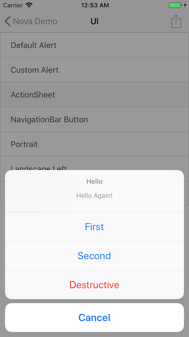

# Nova


A lightweight HTML container for iOS.

# Features

* Full-screen native-like container
* JavaScript injection
* Automatically loads remote URL/local resources
* Modulized MessageHandlers
* Dynamically initialize ViewControllers and pass parameters
* JavaScript callback from native UI components

# Screenshot



# Usage

## Install

`pod install nova`

## Basic

Simply use `NovaRootViewController` or its subclass, and set its `url` property to a local HTML resource or a remote website.

## Navigation

### Basic Usage

```javascript
nova.navigation.postMessage({ type: 'show', url: 'navigation.html', title: 'Navigation' });
```

`type` parameter has 4 values: `show`, `present`, `pop` and `dismiss`. Each calls corresponding methonds in UIKit. Another reserved parameter is `nav`, which is used with `present` and if set to `true`, the presented ViewController will be within a `UINavigationController`.

By default, this method will initialize a `NovaRootViewController` instance. Parameters other than `type`, `class`, `nav` would be automatically added to the new instance.

### Custom Class

```javascript
nova.navigation.postMessage({type: 'show', class: 'DemoViewController'});
```

Pass a `class` parameter. This method will initialize a new instance of `class` that you passed. Also, parameters other than `type`, `class`, `nav` would be automatically added to the instance. Please make sure that `class` is a subclass of `UIViewController`.

## UI

### Alert

#### Default Alert

```javascript
alert('message here');
```

#### Custom Alert

```javascript
nova.ui.postMessage({ alert: {
    title: 'Hello', 
    message: 'Hello Again!', 
    actions: [
        {
            title: 'OK', 
            callback: 'alert(\'Callback from OK action\');' 
        }, {
            title: 'Cancel', 
            callback: 'alert(\'Callback from Cancel action\');', 
            style: 'destructive'
        }
    ]
}});
```

`style` parameter has 3 possible values: `cancel`, `destructive` and `default`. Each of them is the same with corresponding `UIAlertActionStyle` enum value. 

### ActionSheet

```javascript
nova.ui.postMessage({ actionSheet: { 
    title: 'Hello', 
    message: 'Hello Again!', 
    actions: [
        {
            title: 'First', 
            callback: 'alert(\'Callback from First action\');' 
        }, {
            title: 'Second', 
            callback: 'alert(\'Callback from Second action\');' 
        }, {
            title: 'Destructive',
            callback: 'alert(\'Callback from Destructive action\');',
            style: 'destructive'
        }, {
            title: 'Cancel', 
            style: 'cancel'
        }
    ]
}});
```

Same as alert.

### NavigationBar Button

```javascript
nova.ui.postMessage({ rightBarButton: {
    style: 'action', 
    callback: 'alert(\'This is a UIBarButtonItem\');' 
}});
```

Besides `rightBarButton`, you can also use `leftBarButton`, which, of course, sets the left UIBarButtonItem of the NavigationBar.

You can either use `style` or `title` parameter to customize the button, but only one parameter will make effect, which by default is `title`. For `style` parameter, it will be casted to `UIBarButtonSystem` enum, and there's a very direct mapping:

```objective-c
@{
    @"add": @(UIBarButtonSystemItemAdd),
    @"done": @(UIBarButtonSystemItemDone),
    @"cancel": @(UIBarButtonSystemItemCancel),
    @"edit": @(UIBarButtonSystemItemEdit),
    @"save": @(UIBarButtonSystemItemSave),
    @"camera": @(UIBarButtonSystemItemCamera),
    @"trash": @(UIBarButtonSystemItemTrash),
    @"reply": @(UIBarButtonSystemItemReply),
    @"action": @(UIBarButtonSystemItemAction),
    @"organize": @(UIBarButtonSystemItemOrganize),
    @"compose": @(UIBarButtonSystemItemCompose),
    @"refresh": @(UIBarButtonSystemItemRefresh),
    @"bookmarks": @(UIBarButtonSystemItemBookmarks),
    @"search": @(UIBarButtonSystemItemSearch),
    @"stop": @(UIBarButtonSystemItemStop),
    @"play": @(UIBarButtonSystemItemPlay),
    @"pause": @(UIBarButtonSystemItemPause),
    @"redo": @(UIBarButtonSystemItemRedo),
    @"undo": @(UIBarButtonSystemItemUndo),
    @"rewind": @(UIBarButtonSystemItemRewind),
    @"fastforward": @(UIBarButtonSystemItemFastForward)
}
```

### Orientation

```javascript
nova.ui.postMessage({ orientation: 'portrait' });
```

`orientation` parameter has 3 values: `portrait`, `landscapeLeft` and `landscapeRight`.

## Data

### Key-Value storage

#### Save

Save value 'value_you_want_to_save' to key 'key_name'.

```javascript
nova.data.postMessage({ action: 'save', key: 'key_name', value: 'value_you_want_to_save'});
```

#### Load

Load value from key 'key_name', then pass the loaded value to the function in callback field.

```javascript
nova.data.postMessage({ action: 'save', key: 'key_name', callback: 'alert' });
```

#### Remove

Remove a key from KV storage.

```javascript
nova.data.postMessage({ action: 'remove', key: 'key_name' });
```

# TODO List

- [ ] Provide more native UIKit APIs
- [ ] JSCore to process JSValue and ObjC objects
- [ ] Safe area
- [ ] Runtime method invocation
- [ ] Swift compatibility
- [ ] UA

# License

Nova is released under the MIT License. 
